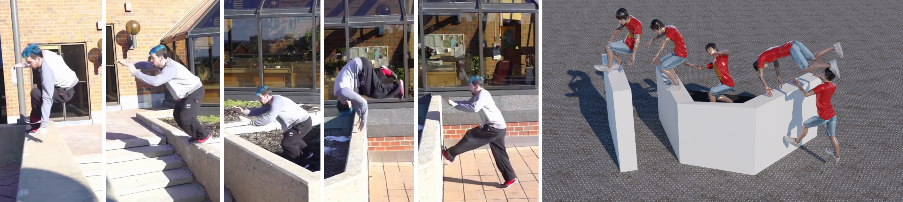

# Human Dynamics from Monocular Video with Dynamic Camera Movements

[Ri Yu](https://yul85.github.io), [Hwangpil Park](https://hpgit.github.io) and [Jehee Lee](https://mrl.snu.ac.kr/~jehee)

Seoul National University

ACM Transactions on Graphics, Volume 40, Number 6, Article 208. (SIGGRAPH Asia 2021)

## Abstract
We propose a new method that reconstructs 3D human motion from in-the wild video by making full use of prior knowledge on the laws of physics. Previous studies focus on reconstructing joint angles and positions in the body local coordinate frame. Body translations and rotations in the global reference frame are partially reconstructed only when the video has a static camera view. We are interested in overcoming this static view limitation to deal with dynamic view videos. The camera may pan, tilt, and zoom to track the moving subject. Since we do not assume any limitations on camera movements, body translations and rotations from the video do not correspond to absolute positions in the reference frame. The key technical challenge is inferring body translations and rotations from a sequence of 3D full-body poses, assuming the absence of root motion. This inference is possible because human motion obeys the law of physics. Our reconstruction algorithm produces a control policy that simulates 3D human motion imitating the one in the video. Our algorithm is particularly useful for reconstructing highly dynamic movements, such as sports, dance, gymnastics, and parkour actions.

## Requirements 

* Ubuntu (tested on 22.04 LTS and 18.04 LTS)

* Python 3 (tested on version 3.6+)

* Dart (modified version, see below)

* Fltk 1.3.4.1

## Installation

**Dart**

    sudo apt install git cmake wget build-essential freeglut3-dev libeigen3-dev libassimp-dev libccd-dev libfcl-dev libboost-regex-dev libboost-system-dev libopenscenegraph-dev coinor-libipopt-dev libbullet-dev libode-dev liboctomap-dev libflann-dev libtinyxml2-dev liburdfdom-dev doxygen libxi-dev libxmu-dev liblz4-dev
    
    # Ubuntu 18.04
    sudo apt install libnlopt-dev
    
    # Ubuntu 22.04
    sudo apt install libnlopt-cxx-dev libboost-filesystem-dev
    
    git clone https://github.com/hpgit/dart-ltspd.git
    cd dart-ltspd
    mkdir build
    cd build
    cmake ..
    make -j4
    sudo make install
  

**Pydart**

    wget http://archive.ubuntu.com/ubuntu/pool/universe/s/swig/swig3.0_3.0.12-1_amd64.deb
    sudo dpkg -i swig3.0_3.0.12-1_amd64.deb
    sudo apt install python3-venv python3-dev

after making a virtual environment (venv) in the movingcam repo,

    source venv/bin/activate
    git clone https://github.com/hpgit/pydart2.git
    cd pydart2
    pip install -U pip
    pip install wheel
    pip install numpy
    
    # Python 3.6
    pip install pyopengl==3.1.0
    pip install pyopengl-accelerate==3.1.0
    
    # Python 3.7 or above
    pip install pyopengl pyopengl-accelerate
    
    python setup.py build
    python setup.py install

**Fltk and Pyfltk**

    sudo apt install libfltk1.3-dev

Download [pyfltk](https://sourceforge.net/projects/pyfltk/files/pyfltk/pyFltk-1.3.4.1/pyFltk-1.3.4.1_py3.tar.gz/download)

    cd ~/Downloads
    tar xzf pyFltk-1.3.4.1_py3.tar
    cd pyFltk-1.3.4.1
    python setup.py build
    python setup.py install

**misc**

    sudo apt install libgle3-dev
    
    # Python 3.6
    pip install torch
    pip install cvxopt
    pip install scipy
    pip install gym
    pip install tensorboard==2.0.0
    pip install setuptools==59.5.0
    pip install pillow

    # Python 3.7 or above
    pip install torch==1.13.1 cvxopt scipy gym tensorboard pillow

## Steps for running with a custom video

1. Run [OpenPose](https://github.com/CMU-Perceptual-Computing-Lab/openpose) to get 2D poses (.json). 

2. Run "foot_contact/annotate.py" to get contact information ([motion_name]_contact_info.npy) from step 1.  

3. Run [VIBE](https://github.com/mkocabas/VIBE) to get 3D poses (.pkl). 

4. Run "ik/get_bvh_from_vibe_limited_v2.py" to get the IK result ([motion_name].skmo) from step 3.  

5. Define the environment (interacting objects) in the "control/[motion_name]/[motion_name]_env.py". (You can search for related code lines by the word "box".)

6. Run PPO "control/hurdle/[motion_name]_ppo_mp.py".

## Run examples

    source venv/bin/activate
    export PYTHONPATH=$PWD
    export LD_LIBRARY_PATH=/usr/local/lib
    cd control/parkour1
    python3 render_parkour1.py

## Bibtex

    @article{Yu:2021:MovingCam,
        author = {Yu, Ri and Park, Hwangpil and Lee, Jehee},
        title = {Human Dynamics from Monocular Video with Dynamic Camera Movements},
        journal = {ACM Trans. Graph.},
        volume = {40},
        number = {6},
        year = {2021},
        articleno = {208}
    }
